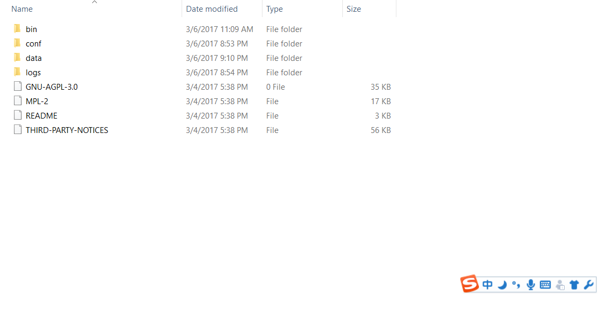
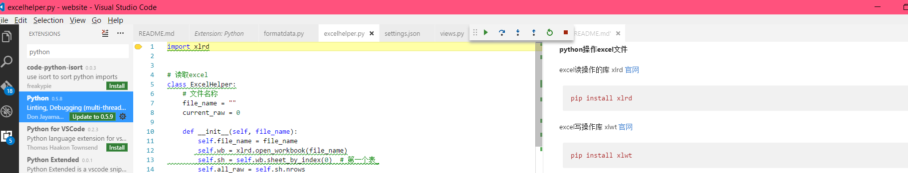
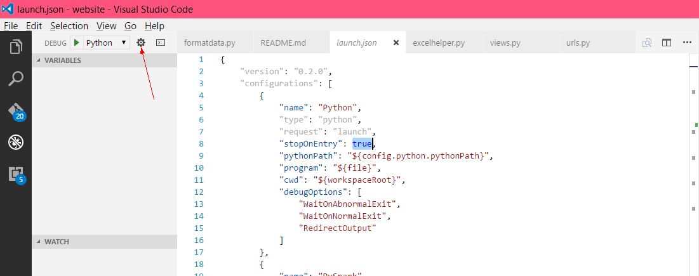
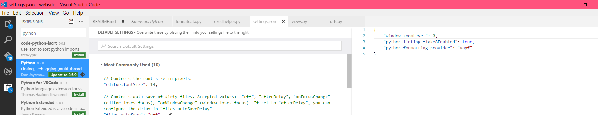

#### python_mongodb

* mongodb作为Windows服务安装

  
mongod.exe --config "c:\Program Files\MongoDB\Server\3.5\conf\mongodb.config" --install --serviceName "mongodb"  
启动服务
net start mongodb

#### Django使用

启动服务

```python
python manage.py runserver 8080
```

#### celery 结合(Django使用)

celery安装命令

```python
pip install django-celery
```

#### [什么是django-celery](https://pypi.python.org/pypi/django-celery)

安装django-celery

```python
pip install django-celery
```

卸载

```python
pip uninstall django-celery
```

#### python操作excel文件

excel读操作的库 xlrd [官网](https://pypi.python.org/pypi/xlrd)

```pthon
pip install xlrd
```

excel写操作库 xlwt [官网](https://pypi.python.org/pypi/xlwt/)

```pthon
pip install xlwt
```

还有一个xlwt-future(只支持 python 低版本，不推荐使用)，[官网](https://pypi.python.org/pypi/xlwt-future)


#### VS Code安裝python插件 [官网](http://donjayamanne.github.io/pythonVSCode/)

默认情况下用VS Code打开python脚本会提示你去下载python插件,如果没有,点击VS左边菜单栏最后一个搜python
选择DonJayamonne python安装,如果你已经在window path目录下配置好Python环境变量已经可以使用了

按下F5会跳出运行工具栏也可以按两下F5直接运行（默认情况下按两下F5运行，也可以配置,修改launch.json）如下图所示

把stopOnEntry改成false就可以
还可以用，其他插件增强python插件的功能，以下是安装 flake8 （flake8包含PEP8工具检查pythn编码规范和Pyflakes工具运行前检查错误的功能）
和 yapf(用来代码格式化)

```python
# 安装flake8
pip install flake8
# 安装yapf
pip install yapf
```

接下来配置插件,file-->preference-->user settings,右侧追加 "python.linting.flake8Enabled": true 和
 "python.formatting.provider": "yapf"  如图所示
 

就可以用 alt+shift+f 格式化代码

python 插件默认使用pylint作为代码规范检查工具，但是实际你也可以禁用，[请看官网](https://github.com/DonJayamanne/pythonVSCode/wiki/Linting)
插件其他配置可以去官网查看并自行设置 [官网](https://github.com/DonJayamanne/pythonVSCode/wiki)

还有一个插件用来代码格式化可以替代 yapf,叫 autopep8

```python
pip install autopep8
```

配置跟上面的yapf

最后的最后发现开发Python最好的工具还是jetbbrains产品PyCharm，极力推荐 [Pycharm](https://www.jetbrains.com/pycharm/download/#section=windows)

